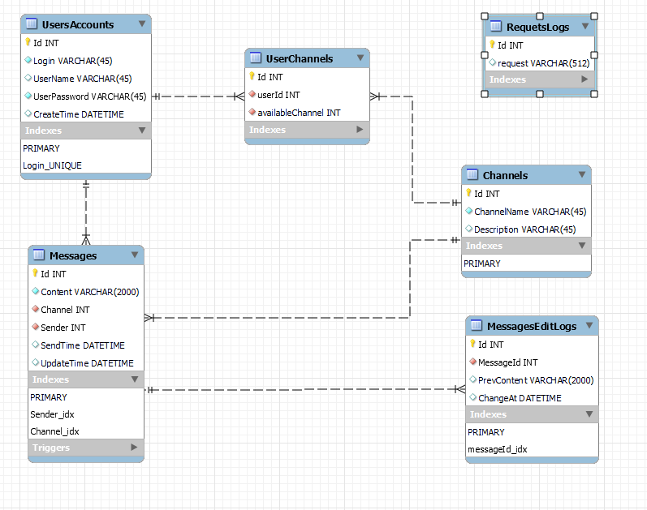

# Корпоративный мессенджер
Данный проект является дипломной работой. 
Это небольшая система для связи внутри некой компании, которая имеет приложение, непосредственно использующееся пользователями, сервер обрабатывающий все запросы и работает с бд.

## Запуск сервера
[Имея установленный докер](https://www.docker.com/ "Ссылка на скачивание"), прописать в консоли, находясь в папке проекта: ```docker-compose up```.

## Запуск клиента
Пока не придумал, но скоро будет ...

### Структура бд

